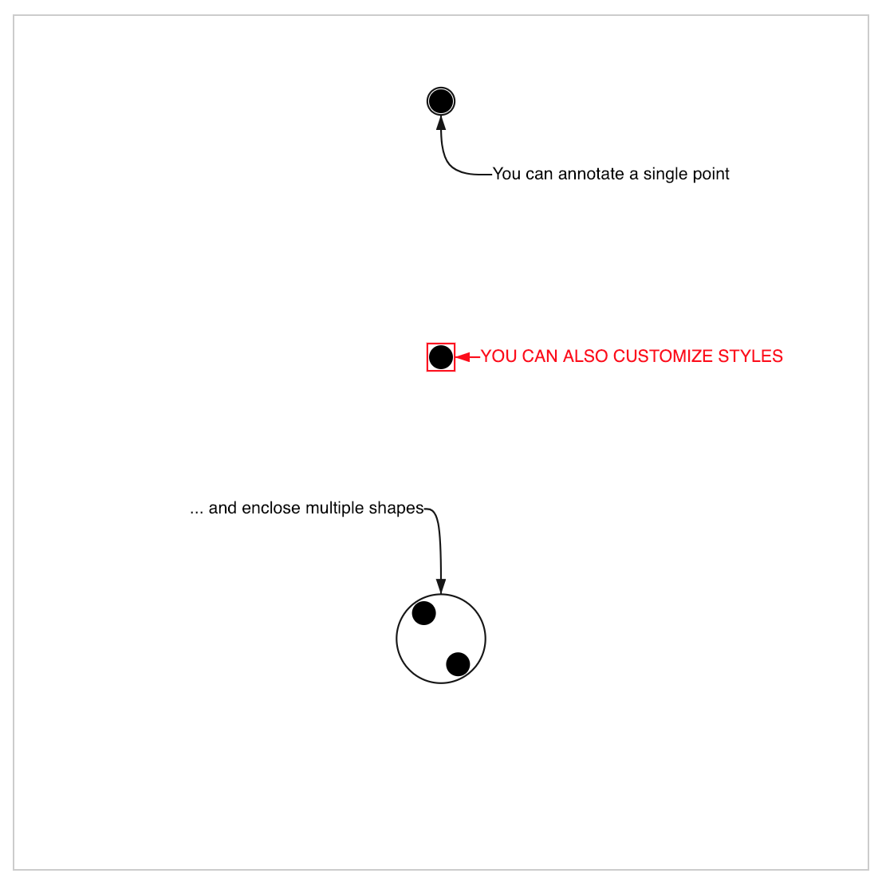

# Annotation

> A minimalist and opinionated annotation component for charts in SVG



## Disclaimer

Annotations have become really importants for data visualization theses days. This React component allows you to easily create small annotations in SVG charts. It is not as powerfull as the great [react-annotation](https://react-annotation.susielu.com/) by Susie Lu but it is quite simple.

## Paradigm

It's a single component which analyzes its children (only circles and rects are supported), builds an **enclosing shape** (circle or rect), and then properly places an **arrow connetor** to link **the given label** and its coordinates (relatives to the previously computed enclosing shape).

-   The children are not rendered, there are only a convenient way to specify the boundaries of the enclosing shape.
-   This is why children are only rects and circles... They act as basic bounding boxes to target the data you want to annotate. For instance, if you want to annotate a complex shape (let's say a country path), you'll have to compute first the bouding box and then give it as child of the Annotation component.

## Install

This module has 4 peer dependencies:

```bash
npm i d3-hierarchy d3-shape react react-dom # peer dependencies
npm i @seracio/annotation
```

## Basic usage

```jsx
import React from 'react';
import { render } from 'react-dom';
import Annotation from '@seracio/annotation';

const size = 500;
const data = [
    {
        color: 'black',
        position: [250, 50],
        radius: 7
    },
    {
        color: 'black',
        position: [250, 200],
        radius: 7
    },
    {
        color: 'black',
        position: [240, 350],
        radius: 7
    },
    {
        color: 'black',
        position: [260, 380],
        radius: 7
    }
];

render(
    <svg
        preserveAspectRatio="xMidYMid meet"
        viewBox={`0 0 ${size} ${size}`}
        style={{
            border: 'solid 1px #ccc',
            fontFamily: 'sans-serif',
            width: '100%'
        }}
        xmlns="http://www.w3.org/2000/svg"
    >
        {/** draw all your points */}
        {data.map((d, i) => (
            <circle
                key={i}
                cx={d.position[0]}
                cy={d.position[1]}
                r={d.radius}
                fill={d.color}
            />
        ))}

        {/** you can annotate a single point */}
        <Annotation dx={30} dy={35} label={'You can annotate a single point'}>
            {/** this shape will not be displayed, it is just to specify the size
                 of the item you want to annotate */}
            <circle
                cx={data[0].position[0]}
                cy={data[0].position[1]}
                r={data[0].radius}
            />
        </Annotation>

        <Annotation
            dx={15}
            label={'You can also customize styles'}
            enclosingType="rect"
            labelStyle={{ color: 'red', textTransform: 'uppercase' }}
            enclosingStyle={{ stroke: 'red' }}
            arrowStyle={{ stroke: 'red' }}
        >
            <circle
                cx={data[1].position[0]}
                cy={data[1].position[1]}
                r={data[1].radius}
            />
        </Annotation>

        {/** the Annotation component will enclose all its children shapes  */}
        <Annotation dx={-10} dy={-50} label="... and enclose multiple shapes">
            {data
                .filter(d => d.position[1] > 300)
                .map((d, i) => (
                    <circle
                        key={i}
                        cx={d.position[0]}
                        cy={d.position[1]}
                        r={d.radius}
                    />
                ))}
        </Annotation>

        <Annotation
            dx={0}
            dy={20}
            label="this is a very long comment on multiple lines"
        >
            {data
                .filter(d => d.position[1] > 300)
                .map((d, i) => (
                    <circle
                        key={i}
                        cx={d.position[0]}
                        cy={d.position[1]}
                        r={d.radius}
                    />
                ))}
        </Annotation>
    </svg>
);
```

## API

### Props

```typescript
type AnnotationProps = {
    label?: string;
    dx?: number;
    dy?: number;
    enclosingType?: 'circle' | 'rect';
    arrowStyle?: any;
    enclosingStyle?: any;
    labelStyle?: any;
    labelWidth?: number;
    enclosingCardinal?: 'n' | 's' | 'w' | 'e' | 'auto';
    children: any;
};
```

### And default props

```typescript
Annotation.defaultProps = {
    label = '',
    dx = 0,
    dy = 0,
    enclosingType = 'circle',
    enclosingCardinal = 'auto',
    enclosingStyle = {},
    arrowStyle = {},
    labelStyle = {},
    labelWidth = 100,
    children
};
```

## Caveats

-   No multi lines
-   This library does not support transform attributes on children
