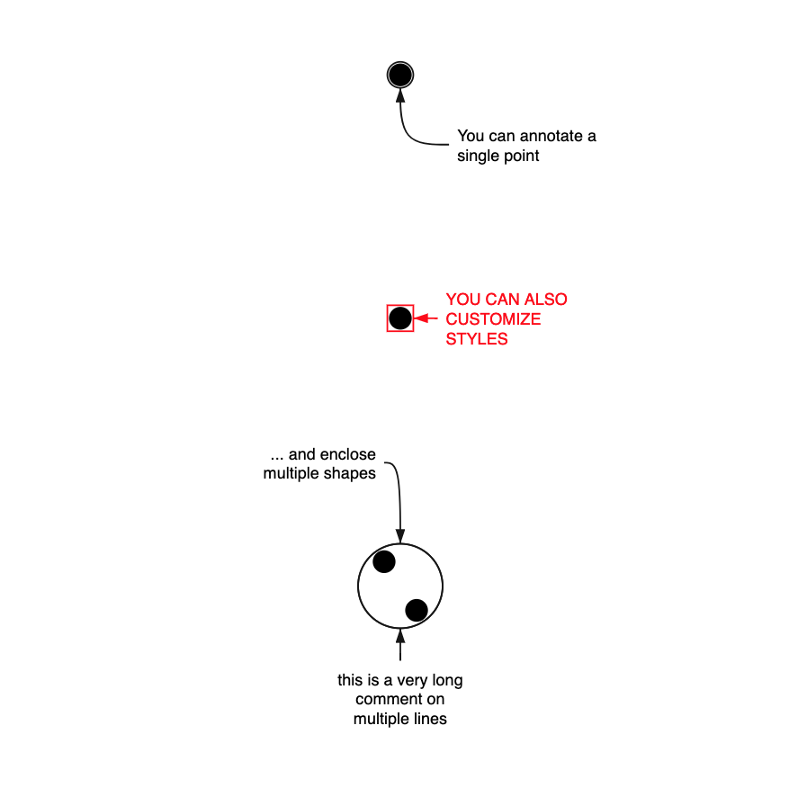

# Annotation

> A minimalist and opinionated annotation component for charts in SVG



## Disclaimer

Annotations have become really importants for data visualization those days. This React component allows you to easily create small annotations in SVG charts. It is not as powerfull as the great [react-annotation](https://react-annotation.susielu.com/) by Susie Lu but is way more simple.

It is a single component which analyzes its children (only circles for now), build an enclosing circle, and then properly places an arrow connetor to link the given label and its coordinates (relatives to the previously computed enclosing circle).

## Install

This module has 4 peer dependencies:

```bash
npm i d3-hierarchy d3-shape react react-dom @seracio/annotation
```

## Basic usage

```jsx
import React from 'react';
import { render } from 'react-dom';
import Annotation from '@seracio/annotation';

const size = 500;
const data = [
    {
        color: 'black',
        position: [250, 50],
        radius: 7
    },
    {
        color: 'black',
        position: [250, 200],
        radius: 7
    },
    {
        color: 'black',
        position: [240, 350],
        radius: 7
    },
    {
        color: 'black',
        position: [260, 380],
        radius: 7
    }
];

render(
    <svg
        preserveAspectRatio="xMidYMid meet"
        viewBox={`0 0 ${size} ${size}`}
        style={{
            border: 'solid 1px #ccc',
            fontFamily: 'sans-serif',
            width: '100%'
        }}
    >
        {/** draw all your points */}
        {data.map((d, i) => (
            <circle
                key={i}
                cx={d.position[0]}
                cy={d.position[1]}
                r={d.radius}
                fill={d.color}
            />
        ))}

        {/** you can annotate a single point */}
        <Annotation dx={30} dy={35} label={'You can annotate a single point'}>
            {/** this shape will not be displayed, it is just to specify the size 
                 of the item you want to annotate */}
            <circle
                cx={data[0].position[0]}
                cy={data[0].position[1]}
                r={data[0].radius}
            />
        </Annotation>

        <Annotation
            dx={15}
            label={'You can also customize styles'}
            labelStyle={{ fill: 'red', textTransform: 'uppercase' }}
            circleStyle={{ stroke: 'red' }}
            arrowStyle={{ stroke: 'red' }}
        >
            <circle
                cx={data[1].position[0]}
                cy={data[1].position[1]}
                r={data[1].radius}
            />
        </Annotation>

        {/** the Annotation component will enclose all its children shapes  */}
        <Annotation dx={-10} dy={-50} label="... and enclose multiple shapes">
            {data
                .filter(d => d.position[1] > 300)
                .map((d, i) => (
                    <circle
                        key={i}
                        cx={d.position[0]}
                        cy={d.position[1]}
                        r={d.radius}
                    />
                ))}
        </Annotation>
    </svg>
);
```

## API

### Props

```typescript
type AnnotationProps = {
    children: any;
    label?: string;
    dx?: number;
    dy?: number;
    arrowStyle?: any;
    circleStyle?: any;
    labelStyle?: any;
    circleCardinal?: 'n' | 's' | 'w' | 'e' | 'auto';
};

### And default props

Annotation.defaultProps = {
    label: '',
    dx: 0,
    dy: 0,
    arrowStyle: {},
    circleStyle: {},
    labelStyle: {},
    circleCardinal: 'auto'
};
```

## Caveats

-   It only supports circles as children right now (rects coming soon)
-   No multi lines
-   Only enclosing circles (rectangles could be great)
